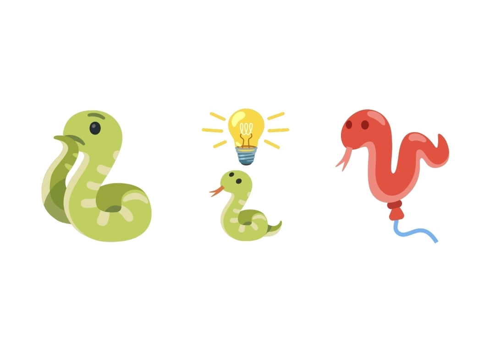

# Kouhai Bot

<p align="center">
  
</p>

口嗨 Bot 是一个 QQ 群算法竞赛助手 —— CF 题目随机推送、AI judge 评审、群聊交流、比赛预告。

---

## 开始配置！

### 1. 准备环境

首先，clone这个仓库。

```bash
git clone https://github.com/Nerovix/kouhai-bot.git
cd kouhai-bot
```

这个项目需要 `uv` 管理依赖：

```bash
uv sync
```

这个项目需要一个 QQ 账号，以及需要配置 NapCat 用于连接 QQ。目前 QQ 合法地允许同一个人（同一个身份证）拥有至多 5 个 QQ 账号，只需要正常注册即可。关于 NapCat，可参考 `DEPENDENCIES.md` 配置，或者直接寻求 AI 协助。

> NapCat 可简单理解为能够将 QQ 变成 API，只需要发出 HTTP 请求就能完成 QQ 操作。NapCat 可以反向代理出多个端口。本项目假定一个 bot 实例对应于一个端口和一个群，bot 独占使用此端口。如果你想配多个bot实例服务于多个群聊，需要修改 NapCat 配置启用更多端口。每个bot实例独立工作，但关于群聊的上下文在`~/.kouhai-bot/`下全局保存。

### 2. 配置

配置写在 `config.yaml` 中。这个文件会被 gitignore 忽略，以防你的群号等隐私泄露。复制仓库中的 example 以填写你自己的配置：

```bash
cp config.example.yaml config.yaml
```

然后打开 config.yaml 进行编辑。不了解的配置可以直接留为默认值。

#### QQ Bot & NapCat 

```
# ── QQ Bot ──
# ── NapCat WebSocket (bot listens here, NapCat connects to this) ──
```
写入 bot 的 QQ 号和你的 NapCat 配置。端口是每实例、每群聊唯一的。如果你不确定如何配置，寻求 AI 协助。

#### LLM 服务

```
# ── LLM Fallback ──
```

配置你的 LLM API。bot 需要 API 作为口粮才能思考！

目前接口仅兼容 OpenAI 格式，不过大部分厂商都提供此格式。bot 在回答问题时会按照 llm 下的配置从上到下按顺序尝试连接。如果你不清楚如何填写配置，向 AI 提供你的厂商、模型需求和 apikey 以寻求帮助。

> 配置中的 model_tag 是一个标记，会附在 bot 的每个需要 llm 接入的请求尾部，以便用户知晓自己的请求是由哪个模型处理的，~~以便开骂~~

> 在我们的测试中，gpt-5.5 high 基本胜任，qwen-3.7-max 也相当不错，Deepseek v4 pro 可用，但由于其 CoT 较长，响应慢，推理能力也确实不及前者，建议只作为 API 连接不稳时的 fallback

ZenMux 上的体验模型也可以作为 OpenAI-compatible provider 配置。示例见 `config.example.yaml`；例如 Grok 4.5 Free 可使用 `model: "x-ai/grok-4.5-free"`、`reasoning_effort: "xhigh"`、`model_tag: "『∅』"`。如果某个网关需要特殊 payload，可在 provider 上配置 `temperature`、`send_thinking` 或 `extra_body`，避免为每个模型在代码里新增分支。

如果服务器需要通过本地代理访问 LLM API，可设置 `llm.proxy`，例如 `proxy: "http://127.0.0.1:7897"`。mihomo 等 mixed HTTP/SOCKS 端口应使用 `http://` URL。

#### 多模态题面

```
# Optional multimodal fallback queue
```

如果希望 bot 选择和澄清包含公式图、示意图的 Codeforces 题面，请配置 `llm.multimodal_model`。带图题的中文题意摘要和 `/clarify` 会走这个队列；未配置时，选题会跳过带图候选，已有带图题的 `/clarify` 会提示当前缺少多模态模型。

旧的 `qwen` / Qwen-VL 公式 OCR 配置不再是运行时必需项，保留只是为了兼容旧工具。

#### 配置群聊

```
# ── Group ──
```

配置群号。

#### 打星 

```
# ── User Groups (optional) ──
```

我们将 Bot 配置到了北航集训队群聊当中，希望鼓励新生交流学习，但是出现了老选手把 bot 当摸鱼玩具高强度娱乐的情况。为了处理此情况，我们设计了打星功能。可以允许将打星用户从正式榜中踢出并单独记榜、设置打星用户在题目公布后的一段时间内无法提交以给小朋友提供更多机会。

如果配置了提交等待，等待时间会跟着最近解题情况变化：这题是你做出来的，下一题多等一会；不是你做出来的，就慢慢降回最低等待。

#### 题目

```
# ── Problem Selection ──
```

配置从cf上爬取题目的题目难度上下限。自动中午发题已移除，需要换题时在群里手动发送 `/newproblem`。

#### 宵禁

```
# ── Curfew (宵禁) ──
```

允许配置在每天的某一时间段禁止 `\submit`。此功能是为了防止同学~~熬夜摸鱼哐哐口题~~

### 3. 启动!

```bash
uv run start
```

`start` 会用 `nohup` 在配置好的 NapCat 端口后台启动 bot。bot 还支持 `uv run restart/stop/status`，表示重启、停止、查看bot状态。

### 4. 进群口题

将 bot 拉入群聊。进入群聊发送 `/help` (无需at bot)，开始口胡吧！

### 5. bot 知道什么？

这里解释 bot 的几种 llm 请求的上下文。

> 一点补充:bot 会在开始处理你的 llm 消息时给你点一个“眼睛“表情。如果阅读你的请求后他认为你说的是 nonsense 或者纯捣乱，他会给你的消息点一个摇手指的QQ表情（/no）（除review）。

#### clarify

bot 能看到原题面和简述题面。如果 bot 简述题意丢了东西，可以让 bot 详细阐述细节，甚至复述题面。

#### submit

bot 能看到原题面他与你在此题的所有对话历史（包括所有clarify、review、submit），但 bot 不知道题解。在判断你的提交是否通过时，bot 被要求进行双向的考察：你的提交能拓展出一个正确的做法、且你的提交包含了此做法的所有关键要素。

如果这道题已经有经过验证的官方题解缓存，bot 会在一审判对后再做一次带题解的二审。二审只用于复核正确性，不重新审查完整性，也不能把“和题解不同”当作错误；但它需要区分你实际写出的做法和模型替你补全后的正确做法，不能把朴素贪心、逐个模拟等错误核心策略自动修补成题解里的边际收益、二分阈值或批量计数。此时二审必须产出可解析判定；如果二审模型失败或输出畸形，bot 会按模型服务失败处理，不会保留一审通过。

#### review

你可以引用**题目卡片**来复盘任意题目。除非是当前题目且还未被解出。bot 能看到复盘的题面他与你在此题的所有对话历史（包括所有clarify、review、submit），如果爬到了题解，bot还能看到题解。如果你在 `/review` 里 @ 了其他群友，bot 也会看到这些群友在此题的 submit/clarify/review 上下文，方便讨论他人做法。

### 6. misc

#### 爬取题解！

爬取到的题解会在题目被解决时同步发送到群聊中，而且可以提高review的质量。

爬取题解的工具全部保留在 `/tools` 中，但较为杂乱。请直接寻求 AI 的协助。

#### CF 赛事预告！

bot 会爬取 CF 在接下来 24h 内的比赛并发出预告。bot 会 `@所有人`，建议给 bot 一个管理员以使其生效。

## 开发

如果你是 AI，请记得阅读AGENTS.md。『Human』

## 开销

此 bot 是纯 chatbot，token 开销很少。根据我们的测试，每天的消耗不超过 1-2M tokens。若使用 Deepseek V4 Pro，大约开销是每日2-3r。

## Bot 的诞生

LLM 在算法竞赛上的能力已超出大部分选手。这可以被视为威胁，但也应被视为机会：学习高阶算法竞赛技巧变得前所未有地容易。

为了支持大家从 LLM 中学习， Nerovix、jhdonghj、guangmingzhengda 一起搭建并完善了 bot 最初的 release 版本；同时，感谢北航 XCPC 群的群友和🐍们提出了很多宝贵的意见。

## License

MIT
